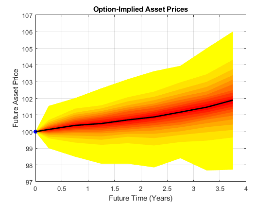

# Estimating Option-Implied Probability Distributions for Asset Pricing

Forecasting the performance of an asset and quantifying the uncertainty associated with such a forecast is a difficult task: one that is frequently made more difficult by a shortage of observed market data.

Recently, there has been interest from central banks in using observed option price data for creating forecasts, particularly during periods of financial uncertainty. Call and put options on an asset are influenced by how the market believes that asset will perform in the future. 

This code, along with the corresponding [technical article](https://uk.mathworks.com/company/newsletters/articles/estimating-option-implied-probability-distributions-for-asset-pricing.html), describes a workflow in which MATLAB® is used to create a forecast for the performance of an asset, starting with relatively scarce option price data observed from the market.

The main steps in this workflow are:

* Computing implied volatility from market data
* Creating additional data points using SABR interpolation
* Estimating implied probability densities
* Simulating future asset prices
* Presenting the forecast uncertainty in a fan chart

## Installation and Getting Started
The examples are provided as a [MATLAB toolbox](https://www.mathworks.com/help/matlab/matlab_prog/create-and-share-custom-matlab-toolboxes.html).
1. Download the toolbox installer (the `Option_Implied_Prices.mltbx` file) from the `Releases` section on GitHub.
2. Double-click on the `Option_Implied_Prices.mltbx` file to install the toolbox.
3. Open the main example script: `>> edit DistributionsForAssetPricing`
4. The examples rely on simulated option price data created by the function `generateSampleOptionData`.

### [MathWorks&reg;](https://www.mathworks.com) Product Requirements

This example requires MATLAB R2025a or a later release.
- [MATLAB&reg;](https://www.mathworks.com/products/matlab.html)
- [Statistics and Machine Learning Toolbox&trade;](https://www.mathworks.com/products/statistics.html)
- [Optimization Toolbox&trade;](https://www.mathworks.com/products/optimization.html)
- [Financial Toolbox&trade;](https://www.mathworks.com/products/finance.html)
- [Financial Instruments Toolbox&trade;](https://www.mathworks.com/products/financial-instruments.html)
- [Curve Fitting Toolbox&trade;](https://www.mathworks.com/products/curvefitting.html)

## License
The license for this entry is available in the [license.txt](license.txt) file in this GitHub repository.

Copyright 2015-2026 The MathWorks, Inc.

## Community Support
[MATLAB Central](https://www.mathworks.com/matlabcentral)
